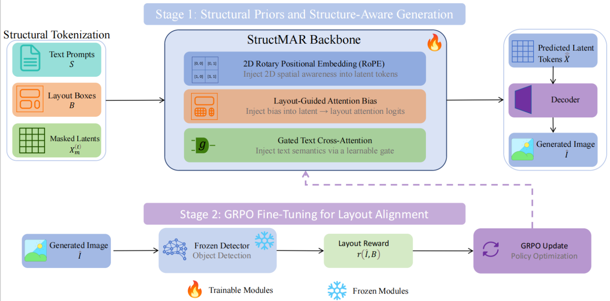
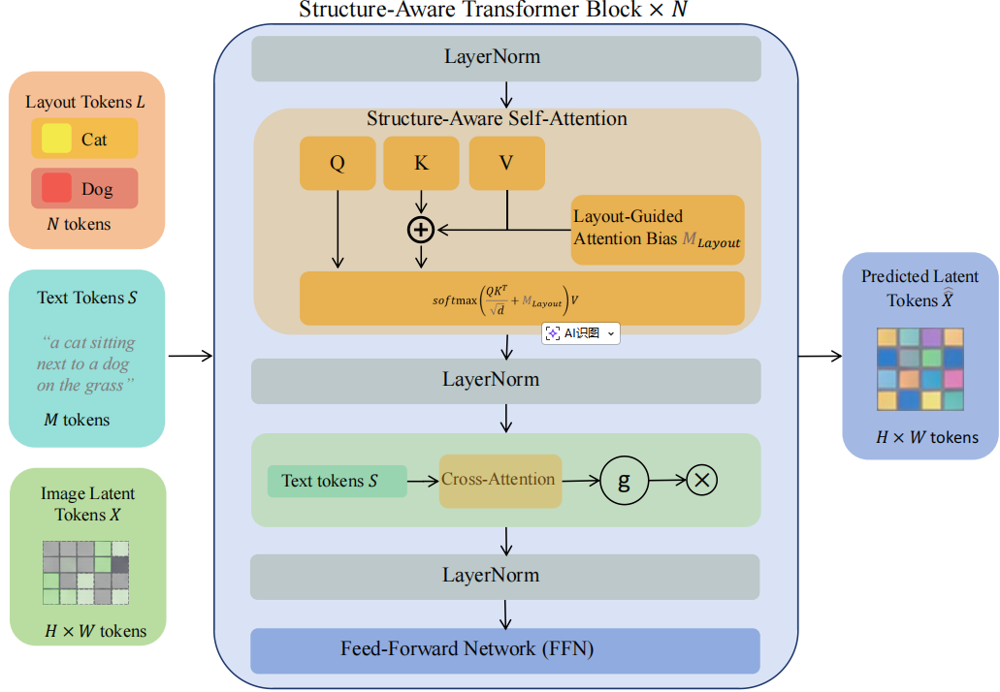

## Figure 1. Overview of StructMAR

**Figure 1. Overview of StructMAR.** The framework consists of three conceptual stages: (1) **Structural Tokenization**, where text prompts $S$, layout boxes $B$, and masked latent tokens $X_m^{(t)}$ are prepared as model inputs; (2) **Structure-Aware Generation**, where the StructMAR backbone integrates 2D RoPE, Layout-Guided Attention Bias, and Gated Text Cross-Attention to generate predicted latent tokens $\hat{X}$, which are then decoded into the image $\hat{I}$ ; and (3) **Metric-Aligned Optimization**, where a frozen detector produces layout rewards $r(\hat{I}, B)$ and GRPO further optimizes the model toward layout-centric metrics.

------

## Figure 2. Structure-Aware Transformer block in StructMAR

**Figure 2. Structure-Aware Transformer block in StructMAR.** Layout tokens $L$ and image latent tokens $X$ are jointly processed by structure-aware self-attention on the sequence $[L; X]$. 2D RoPE is applied to latent queries and keys to restore relative 2D spatial awareness, and the layout-guided attention bias $M_{\text{layout}}$ is injected only into the $A_{XL}$ block (X → L) to enforce explicit latent-to-layout alignment. Text tokens $S$ are introduced through a gated cross-attention branch with learnable gate $g$, followed by LayerNorm and an FFN to preserve semantic consistency and global coherence.

------
## Figure 3. Visual comparison of layout adherence across methods. 

We compare **StructMAR** with **GLIGEN**, **MIGC**, and **MIGC++** under the same layout inputs and prompts.  Across diverse scenes, StructMAR shows stronger alignment between generated objects and target boxes, while preserving more coherent global composition. In contrast, baseline methods are more likely to produce inaccurate object placement, inconsistent scale, or reduced instance controllability. These examples support our claim that explicit latent-to-layout structural execution improves instance-level layout control.

